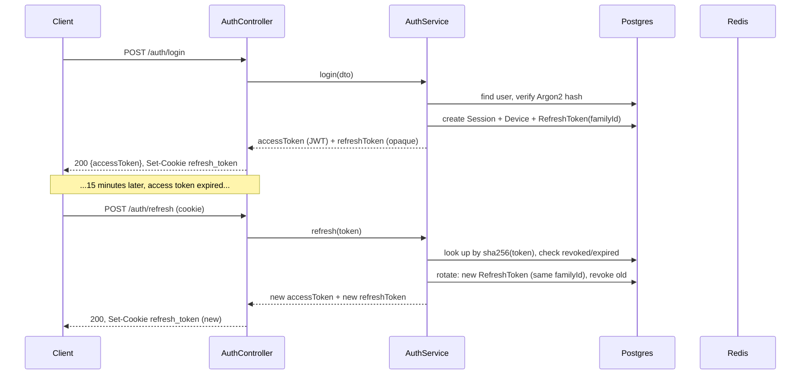
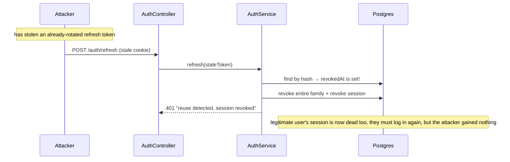
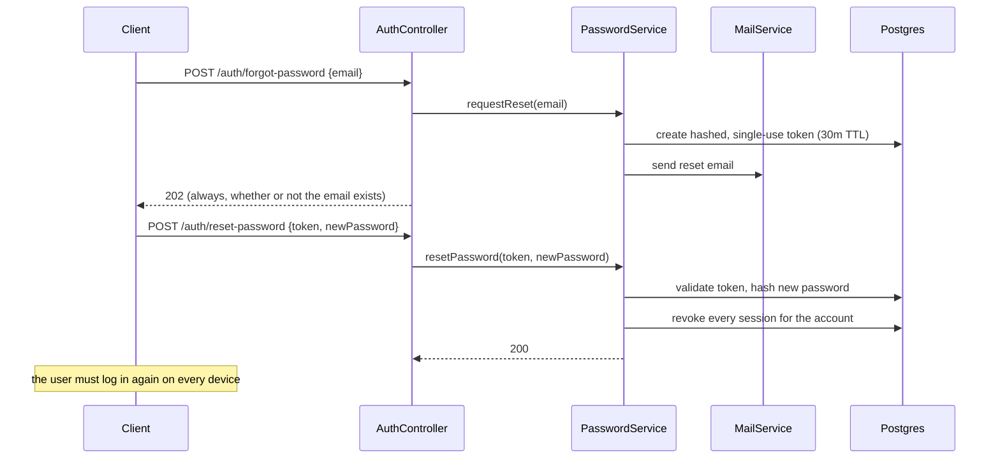

# Atlas Auth

A production-grade authentication and authorization service built with NestJS, PostgreSQL (Prisma), and Redis. Designed to be integrated into a SaaS product as the identity layer, not as a tutorial project — every feature below is implemented and verified end-to-end against a real database and Redis instance, not mocked.

## Contents

- [Features](#features)
- [Architecture](#architecture)
- [Tech stack](#tech-stack)
- [Folder structure](#folder-structure)
- [Getting started](#getting-started)
- [Environment variables](#environment-variables)
- [Database](#database)
- [API reference](#api-reference)
- [Authentication flows](#authentication-flows)
- [Testing](#testing)
- [Deployment](#deployment)
- [Security considerations](#security-considerations)
- [Scaling recommendations](#scaling-recommendations)
- [Known limitations](#known-limitations)

## Features

- Registration, login, logout, JWT access tokens, rotating refresh tokens
- Email verification and an email-change workflow (confirmed only via the new address)
- Forgot/reset password and change password, both revoking sessions
- Role-based and permission-based authorization (`@Roles`, `@RequirePermissions`)
- Session and device tracking, with per-session and "log out other devices" revocation
- Account lockout after repeated failed logins
- Refresh token rotation with replay-attack detection (reusing a rotated token kills the whole token family)
- Redis-backed access-token and session blacklists for instant revocation
- Rate limiting (global + tighter limits on credential-sensitive endpoints)
- Structured Winston logging, an event-driven audit trail, and login history
- Swappable mail providers (SMTP, Mailtrap, Resend, SendGrid)
- Global exception handling with safe error messages in production
- Docker dev/prod environments with health checks

## Architecture

Atlas Auth is a **modular monolith**: one deployable NestJS application, internally split into self-contained feature modules that each follow the same internal layering.

```
Controller → Service → Repository → Prisma → PostgreSQL
                 │
                 └─→ emits domain events → EventEmitter2 → Audit/Login-history listeners
```

- **Controllers** only translate HTTP ↔ DTOs. No business logic.
- **Services** hold business logic and orchestrate repositories. They never touch Prisma directly outside their own module's repository.
- **Repositories** are the only place that calls `PrismaService`. This is the seam you'd cut along if a module ever needed to move to its own service.
- **Domain events** (`@nestjs/event-emitter`) decouple side effects — login history and audit logging are written by a listener in `common/audit-log`, not by `AuthService` itself. Adding a new "notify on suspicious login" feature later means adding a listener, not touching `AuthService`.

### Why a modular monolith and not microservices

Auth systems benefit from atomic transactions across concerns that would otherwise cross a network boundary — e.g. registration + audit log + verification-token creation. Splitting into services is an infrastructure decision to make later if/when a specific module (e.g. sessions) needs independent scaling; nothing here prevents that split, since modules only depend on each other through well-defined service/repository interfaces.

### Module map

| Module | Owns |
|---|---|
| `auth` | Register/login/logout/refresh, JWT + token rotation, email verification, password reset/change |
| `users` | Profile, avatar, `/users/me` |
| `roles` | Role CRUD, role↔permission and role↔user assignment |
| `permissions` | Permission CRUD, `PermissionsGuard` |
| `sessions` | Active session listing, per-session and bulk revocation, device tracking |
| `mail` | Provider-agnostic `MailProvider` interface + 4 adapters + templates |
| `database` | `PrismaService`, global |
| `health` | Liveness/readiness for Docker/orchestrators |
| `common` | Redis client, Argon2 hashing, global exception filter, Winston config, audit-log listener, shared decorators/interfaces |
| `config` | Joi-validated, namespaced env configuration |

### Cross-cutting design decisions

- **Passwords**: Argon2id via the `argon2` package, cost parameters configurable via env.
- **Tokens**: short-lived JWT access tokens (15m default, carry `roles`/`permissions` computed at login so authorization checks need zero extra DB round-trips) + opaque 256-bit refresh tokens, stored as SHA-256 hashes, rotated on every use. Reusing an already-rotated refresh token revokes its entire token family and the owning session — this is the standard defense against a stolen-and-replayed refresh token.
- **Revocation**: logout/session-revocation blacklist the access token's `jti` *and* its `sessionId` in Redis, so an outstanding JWT bound to a revoked session dies immediately instead of surviving until its natural expiry.
- **Authorization**: `PermissionsGuard`/`RolesGuard` read straight from the JWT payload — no DB query per request. Trade-off: a role/permission change takes effect on the user's next login or refresh, not instantly. This is a deliberate performance/consistency trade-off, not an oversight.
- **Global exception filter**: normalizes every error to `{statusCode, error, message, timestamp, path}`, maps known Prisma error codes to correct HTTP statuses, and hides internal error messages in production while logging the real one server-side.
- **Everything protected by default**: a global `JwtAuthGuard` requires authentication on every route; endpoints opt out explicitly with `@Public()`.

## Tech stack

NestJS 11 · TypeScript · PostgreSQL · Prisma · Redis (ioredis) · Passport-JWT · Argon2 · Winston · `@nestjs/throttler` · class-validator · Swagger · Jest + Supertest · Docker

## Folder structure

```
src/
  auth/            controllers · services · repositories · dto · guards · strategies · decorators · events
  users/           controllers · services · repositories · dto
  roles/           controllers · services · repositories · dto · guards · decorators
  permissions/     controllers · services · repositories · dto · guards · decorators
  sessions/        controllers · services · repositories · dto · events
  mail/            providers (smtp/mailtrap/resend/sendgrid) · templates
  common/          redis · hashing · audit-log · filters · decorators · interfaces · utils
  config/          env.validation.ts + one file per namespace (app/database/redis/jwt/security/mail/logging)
  database/        PrismaService (global)
  health/          Terminus health checks
prisma/
  schema.prisma
  migrations/
  seed.ts
test/
  e2e/             supertest against a real Postgres + Redis
docker/
Dockerfile         deps → dev / build → production (4 stages)
docker-compose.yml         local dev: app + Postgres + Redis
docker-compose.prod.yml    production: isolated network, resource limits
```

Unit tests are colocated with their source file (`*.spec.ts` next to the module it tests) — the standard Nest convention, and what `npm test`'s Jest config expects.

## Getting started

### Option A — Docker (recommended)

```bash
cp .env.example .env
# edit .env: set JWT_ACCESS_SECRET and COOKIE_SECRET to real 32+ char random values

docker compose up -d postgres redis
docker compose run --rm app npx prisma migrate deploy
docker compose run --rm app npx prisma db seed
docker compose up -d app
```

App: `http://localhost:3000/api/v1` · Swagger UI (dev only): `http://localhost:3000/docs`

### Option B — Local Node

Requires Node 22+, a local PostgreSQL, and a local Redis.

```bash
npm install
cp .env.example .env   # point DATABASE_URL / REDIS_HOST at your local instances
npx prisma migrate deploy
npx prisma db seed
npm run start:dev
```

### Generating secrets

```bash
node -e "console.log(require('crypto').randomBytes(32).toString('base64url'))"
```

Run twice for `JWT_ACCESS_SECRET` and `COOKIE_SECRET` — both must be at least 32 characters (enforced by env validation at boot).

## Environment variables

Full reference lives in [.env.example](.env.example) with inline comments. Summary by concern:

| Group | Key vars | Notes |
|---|---|---|
| App | `PORT`, `APP_URL`, `API_PREFIX`, `CORS_ORIGINS` | `APP_URL` is used to build links in emails |
| Database | `DATABASE_URL` | Postgres connection string |
| Redis | `REDIS_HOST`, `REDIS_PORT`, `REDIS_PASSWORD`, `REDIS_TLS` | Sessions blacklist, rate-limit state (see [Known limitations](#known-limitations)) |
| JWT | `JWT_ACCESS_SECRET`, `JWT_ACCESS_EXPIRES_IN`, `JWT_REFRESH_EXPIRES_IN`, `JWT_ISSUER`, `JWT_AUDIENCE` | Secret must be ≥32 chars |
| Cookies | `COOKIE_SECRET`, `REFRESH_TOKEN_COOKIE_NAME`, `COOKIE_SECURE` | Set `COOKIE_SECURE=true` in any environment served over HTTPS |
| Password hashing | `ARGON2_MEMORY_COST`, `ARGON2_TIME_COST`, `ARGON2_PARALLELISM` | Tune for your hardware; defaults follow OWASP guidance |
| Lockout | `ACCOUNT_LOCKOUT_MAX_ATTEMPTS`, `ACCOUNT_LOCKOUT_DURATION_MINUTES` | Per-account brute-force defense |
| Rate limiting | `THROTTLE_TTL_SECONDS`, `THROTTLE_LIMIT` | Global default; login/register/forgot-password/reset-password have a fixed, tighter 10/60s on top |
| Token TTLs | `EMAIL_VERIFICATION_TOKEN_TTL_MINUTES`, `PASSWORD_RESET_TOKEN_TTL_MINUTES` | |
| Mail | `MAIL_PROVIDER`, `MAIL_FROM`, plus one block per provider (`SMTP_*`, `MAILTRAP_*`, `RESEND_API_KEY`, `SENDGRID_API_KEY`) | Only the active provider's vars need to be set |
| Bootstrap | `ADMIN_EMAIL` | Seed-only, see [Database](#database) |
| Logging | `LOG_LEVEL` | `error` \| `warn` \| `info` \| `http` \| `debug` |

Boot fails fast with a clear error if a required variable is missing or malformed — see `src/config/env.validation.ts`.

## Database

### Schema

12 tables, all UUID-keyed with `createdAt`/`updatedAt`, indexes on every FK and lookup column: `users` (soft-delete via `deletedAt`), `roles`, `permissions`, `role_permissions`, `user_roles`, `sessions`, `devices`, `refresh_tokens`, `email_verification_tokens`, `password_reset_tokens`, `login_history`, `audit_logs`.

```bash
npx prisma migrate dev --name <description>   # create + apply a migration in dev
npx prisma migrate deploy                     # apply pending migrations (CI/prod)
npx prisma studio                              # inspect data visually
```

### Seeding & bootstrapping the first admin

`prisma/seed.ts` is idempotent and creates:
- An 11-entry permission catalog (`users:read`, `roles:write`, `sessions:revoke`, ...)
- An `admin` role with every permission, and an empty `user` role

To grant the very first admin: **register the account through the API first** (so it has a password), then run the seed with `ADMIN_EMAIL` set:

```bash
ADMIN_EMAIL=you@example.com npx prisma db seed
```

The seed looks up that email and assigns it the `admin` role; it warns (without failing) if the account doesn't exist yet. After the first admin exists, use `POST /roles/:id/users/:userId` for everyone else.

## API reference

Full interactive documentation (dev only): `GET /docs`. Base path for everything below is `/api/v1`.

### Auth (`/auth`) — all public except `resend-verification`, `change-password`, `logout`

| Method | Path | Description |
|---|---|---|
| POST | `/auth/register` | Create an account, returns access token + sets refresh cookie |
| POST | `/auth/login` | Authenticate |
| POST | `/auth/refresh` | Rotate the refresh cookie, issue a new access token |
| POST | `/auth/logout` | Revoke the current session, blacklist the access token |
| POST | `/auth/verify-email` | Consume a registration or email-change token |
| POST | `/auth/resend-verification` | Re-send the registration verification email |
| POST | `/auth/forgot-password` | Always 202; sends a reset link if the email exists |
| POST | `/auth/reset-password` | Consume the reset token, revokes **all** sessions |
| POST | `/auth/change-password` | Requires current password, revokes all **other** sessions |

### Users (`/users`)

| Method | Path | Description |
|---|---|---|
| GET | `/users/me` | Current profile |
| PATCH | `/users/me` | Update name/avatar |
| POST | `/users/me/email-change` | Requires password; confirmation goes only to the new address |

### Sessions (`/sessions`)

| Method | Path | Description |
|---|---|---|
| GET | `/sessions` | Active sessions for the caller, with device info and an `isCurrent` flag |
| DELETE | `/sessions/:id` | Revoke one session (must be your own) |
| DELETE | `/sessions` | Revoke every *other* session |

### Roles (`/roles`) — requires `roles:read`/`roles:write`/`roles:assign`

| Method | Path | Description |
|---|---|---|
| GET | `/roles`, `/roles/:id` | List / fetch a role with its permissions |
| POST | `/roles` | Create |
| PATCH | `/roles/:id` | Update |
| DELETE | `/roles/:id` | Delete |
| POST/DELETE | `/roles/:id/permissions/:permissionId`* | Assign/revoke a permission (*POST body is `{permissionId}`) |
| POST/DELETE | `/roles/:id/users/:userId` | Assign/revoke the role on a user |

### Permissions (`/permissions`) — requires `permissions:read`/`permissions:write`

| Method | Path | Description |
|---|---|---|
| GET | `/permissions` | List |
| POST | `/permissions` | Create (`resource:action` naming enforced) |
| DELETE | `/permissions/:id` | Delete |

### Example: full curl walkthrough

```bash
BASE=http://localhost:3000/api/v1

# Register
curl -s -c cookies.txt -X POST $BASE/auth/register \
  -H 'Content-Type: application/json' \
  -d '{"email":"jane@example.com","password":"Str0ng!Passw0rd"}'

# Use the returned accessToken
curl -s $BASE/users/me -H "Authorization: Bearer <accessToken>"

# Refresh (cookie jar carries the refresh_token cookie)
curl -s -b cookies.txt -c cookies.txt -X POST $BASE/auth/refresh

# Logout
curl -s -X POST $BASE/auth/logout -H "Authorization: Bearer <accessToken>" -b cookies.txt
```

## Authentication flows

### Login + refresh rotation



### Replay-attack detection



### Password reset



## Testing

```bash
npm test              # 45 unit tests — services/guards/filters, dependencies mocked at the repository boundary
npm run test:cov      # with coverage
npm run test:e2e      # 8 e2e tests — real HTTP requests against a real Postgres + Redis
```

The e2e suite needs `DATABASE_URL`/`REDIS_HOST` pointed at a real (can be ephemeral/local) Postgres and Redis — it boots the actual `AppModule`, not a stub. It covers the full register → login → protected-route → refresh-rotation → replay-detection → logout → account-lockout journey with real assertions on real HTTP responses, not mocked service calls.

## Deployment

### Docker images

The `Dockerfile` has four stages: `deps` (shared install), `dev` (hot-reload, used by `docker-compose.yml`), `build` (compiles + generates the Prisma client + prunes dev dependencies), `production` (non-root user, minimal image, built-in `HEALTHCHECK` hitting `/api/v1/health`).

```bash
docker build --target production -t atlas-auth:latest .
```

### Production compose

`docker-compose.prod.yml` isolates Postgres/Redis on an internal-only Docker network (only the app container can reach them), reads credentials from environment variables (never hardcoded), and caps the app container's memory.

```bash
export POSTGRES_USER=... POSTGRES_PASSWORD=... POSTGRES_DB=... REDIS_PASSWORD=...
docker compose -f docker-compose.prod.yml up -d
docker compose -f docker-compose.prod.yml run --rm app npx prisma migrate deploy
```

### Checklist before going live

- [ ] `JWT_ACCESS_SECRET` / `COOKIE_SECRET` are real random 32+ char values, not the `.env.example` placeholders
- [ ] `COOKIE_SECURE=true` (requires HTTPS in front of the app)
- [ ] `NODE_ENV=production` (disables Swagger UI, hides internal error messages)
- [ ] A real mail provider configured (`MAIL_PROVIDER` ≠ the local SMTP sandbox)
- [ ] `CORS_ORIGINS` set to your actual frontend origin(s), not `*`
- [ ] First admin bootstrapped via `ADMIN_EMAIL` (see [Database](#database))
- [ ] Redis persistence enabled if you can't tolerate losing the blacklist/session-revocation state on restart (a lost blacklist means a *logged-out* token would work again until its natural expiry — bounded by `JWT_ACCESS_EXPIRES_IN`)

## Security considerations

- **Passwords**: Argon2id, never bcrypt/sha — resistant to GPU cracking, memory-hard.
- **Tokens**: short-lived JWTs; refresh tokens are opaque (not JWTs), stored only as salted-by-design SHA-256 hashes, rotated every use, with replay-attack family revocation.
- **Session revocation is immediate**, not eventually-consistent: revoking a session blacklists it in Redis so already-issued JWTs die instantly rather than surviving to their natural expiry.
- **Brute force**: per-account lockout (5 attempts / 15 min by default) plus a separate IP-based rate limit on login/register/forgot-password/reset-password, deliberately set above the lockout threshold so the two layers don't mask each other (see [Known limitations](#known-limitations) for the nuance).
- **User enumeration**: `forgot-password` always returns 202 regardless of whether the email exists; login returns the same generic message for "no such user" and "wrong password."
- **Cookies**: refresh token is `httpOnly`, `secure` (in production), `sameSite=lax`, signed, and path-scoped to `/api/v1/auth` only — it is never sent to unrelated routes.
- **Headers**: Helmet is applied to every response (HSTS, X-Frame-Options, nosniff, etc.). Content-Security-Policy is deliberately disabled — see the comment in `main.ts` for why (this is a JSON API; the only HTML surface is the dev-only Swagger UI, which a default CSP breaks).
- **Errors**: a global filter ensures internal exceptions never leak stack traces or implementation details in production.
- **Sensitive fields**: `passwordHash` never appears in an API response — every controller returns a DTO built explicitly from allow-listed fields, never a raw Prisma entity.
- **Audit trail**: every security-relevant action (login, logout, password change, session revocation, role/permission changes via the standard CRUD, email verification) is written to `audit_logs`/`login_history` via a decoupled event listener, and independently to Winston structured logs.

## Scaling recommendations

- **The app itself is stateless** and horizontally scalable behind a load balancer — all session/blacklist state lives in Redis, not in-process.
- **Database**: add read replicas and point read-heavy queries (session listing, role/permission lookups) at them once Postgres CPU becomes the bottleneck; the repository layer is the natural seam for this.
- **Redis**: run it as a managed/clustered instance in production; it is a hard dependency for login, refresh, and logout (blacklist checks), not just a cache.
- **Rate limiting storage**: see [Known limitations](#known-limitations) — the throttler currently uses in-memory storage per instance, which needs to move to a shared Redis-backed store before running more than one app replica.
- **Mail**: sending is synchronous today (fire-and-forget within the request, errors logged not thrown). At high signup volume, move `MailService` calls behind a queue (BullMQ, already Redis-adjacent) so a slow mail provider can't add latency to the request path.
- **Audit logs**: if `audit_logs`/`login_history` volume grows large, consider partitioning by month or shipping to a dedicated analytics store — they're written via an isolated repository, so swapping the sink doesn't touch `AuthService`.

## Known limitations

- **Rate-limit storage is in-memory** (`@nestjs/throttler`'s default). This is correct and complete for a single instance, but running multiple replicas behind a load balancer means each instance enforces its own separate limit — effectively multiplying the real limit by the replica count. Before scaling horizontally, swap in a Redis-backed `ThrottlerStorage` implementation.
- **No CI pipeline is included.** `npm test` and `npm run test:e2e` are ready to be wired into one (GitHub Actions, etc.) — the e2e suite just needs a Postgres + Redis service container.
- **First-admin bootstrap is a manual step** (`ADMIN_EMAIL` + re-run the seed) by design — there is intentionally no unauthenticated "make me admin" endpoint.
